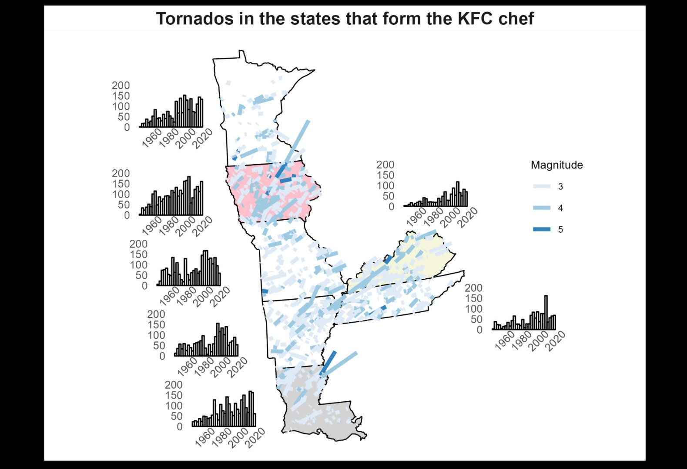
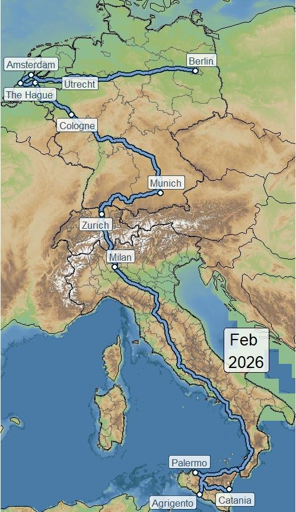

::: {.hero}
# David Méndez Sevillano

::: {.subtitle}
Data Scientist · Visualization · R · Python · D3.js (learning)
:::

I build data visualizations that make complex information clear and compelling.
Currently working in pharmaceutical manufacturing, exploring Bayesian methods
and causal inference.

[View my work →](portfolio.qmd){.btn .btn-primary}
:::

---

::: {.project-grid}

::: {.project-card}

::: {.card-body}
[Europe under the rivers]{.card-title}

[At the time I was dating someone living in Liege where the River Meuse goes through so I made this visual to see how, we looking at the river from our separate houses, we were looking at the same river]{.card-description}

::: {.card-tags}
[R]{.tag}
[map]{.tag}
[rayshader]{.tag}
:::
:::
:::

:::: {.project-card}

::: {.card-body}

[Tornadoes on the Fried chicken chef states]{.card-title}

[Tornadoes in the US states that form a shape of a Chef with a plate of fried chicken. Also you can see the historical frequency and the intensity and direction of the most intense ones]{.card-description}

::: {.card-tags}

[R]{.tag} 
[Tidytuesday]{.tag} 
[Barplot]{.tag}
[map]{.tag}
:::
:::
:::

:::: {.project-card}

::: {.card-body}

[Interrail trip February]{.card-title}

[Map of my train trips last February using an interrail pass]{.card-description}

::: {.card-tags}

[R]{.tag} 
[trains]{.tag}
[map]{.tag}
:::
:::
:::

:::

::: {style="text-align: center; margin-top: 2rem;"}
[See all projects →](portfolio.qmd)
:::
