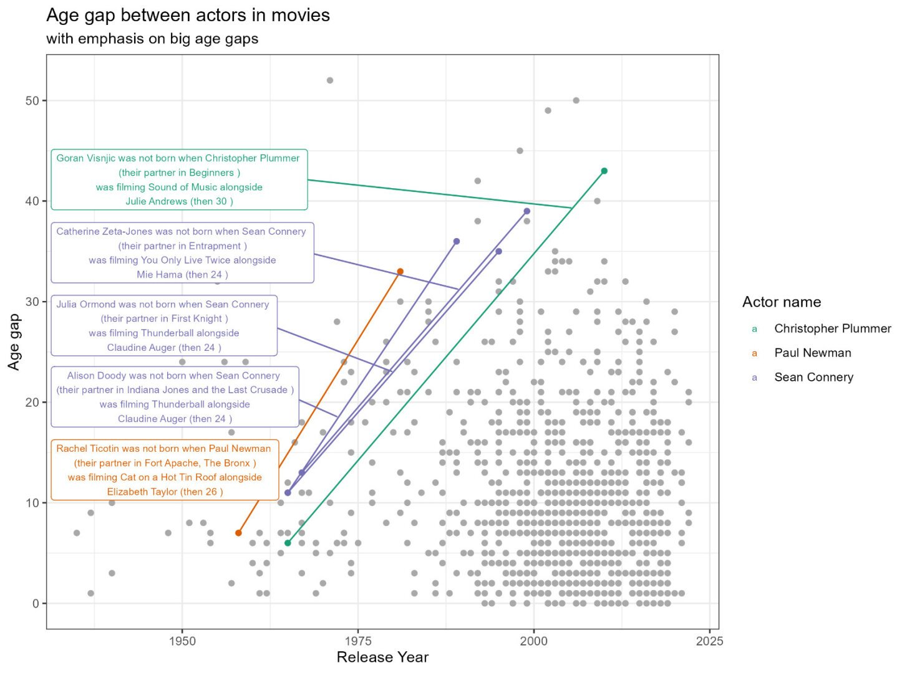

A collection of data visualizations and interactive projects, spanning exploratory analysis, statistical communication, and map visualizations.

:::::::::::: project-grid
<!-- Copy this card block for each project -->

::::: project-card

:::: card-body
[Europe under the rivers]{.card-title}

[At the time I was dating someone living in Liege where the River Meuse goes through so I made this visual to see how, we looking at the river from our separate houses, we were looking at the same river]{.card-description}

::: card-tags
[R]{.tag} 
[map]{.tag} 
[rayshader]{.tag}
:::
::::
:::::

::::: project-card

:::: card-body
[Desert Rodents]{.card-title}

[Visual of ranges of weight and length of different desert rodents Arizona]{.card-description}

::: card-tags
[R]{.tag} 
[Tidytuesday]{.tag} 
[Boxplot]{.tag}
:::
::::
:::::

::::: project-card

:::: card-body
[Age gaps in movie couples across the years]{.card-title}

[Scatterplot showing the age gap between the actors playing a romantic relationship on screen. Highlighted, the case of several actors who had an age gap of 5 years or more with their onscreen partner already before a future onscreen partner was born]{.card-description}

::: card-tags
[R]{.tag} 
[Tidytuesday]{.tag} 
[Scatterplot]{.tag}
:::
::::
:::::

::: {.project-card}

::: {.card-body}

[Tornadoes on the Fried chicken chef states]{.card-title}

[Tornadoes in the US states that form a shape of a Chef with a plate of fried chicken. Also you can see the historical frequency and the intensity and direction of the most intense ones]{.card-description}

::: {.card-tags}

[R]{.tag} 
[Tidytuesday]{.tag} 
[Barplot]{.tag}
[map]{.tag}
:::
:::
:::

::: {.project-card}

::: {.card-body}

[Interrail trip February]{.card-title}

[Map of my train trips last February using an interrail pass]{.card-description}

::: {.card-tags}

[R]{.tag} 
[trains]{.tag}
[map]{.tag}
:::
:::
:::

<!-- ::: {.project-card} -->

<!--  -->

<!-- ::: {.card-body} -->

<!-- [Example: Process Analytics Dashboard]{.card-title} -->

<!-- [What this dashboard monitors and why it matters.]{.card-description} -->

<!-- ::: {.card-tags} -->

<!-- [R]{.tag} -->

<!-- [Shiny]{.tag} -->

<!-- [Process Analytics]{.tag} -->

<!-- ::: -->

<!-- ::: -->

<!-- ::: -->

<!-- Add more cards here as you build projects -->
::::::::::::
