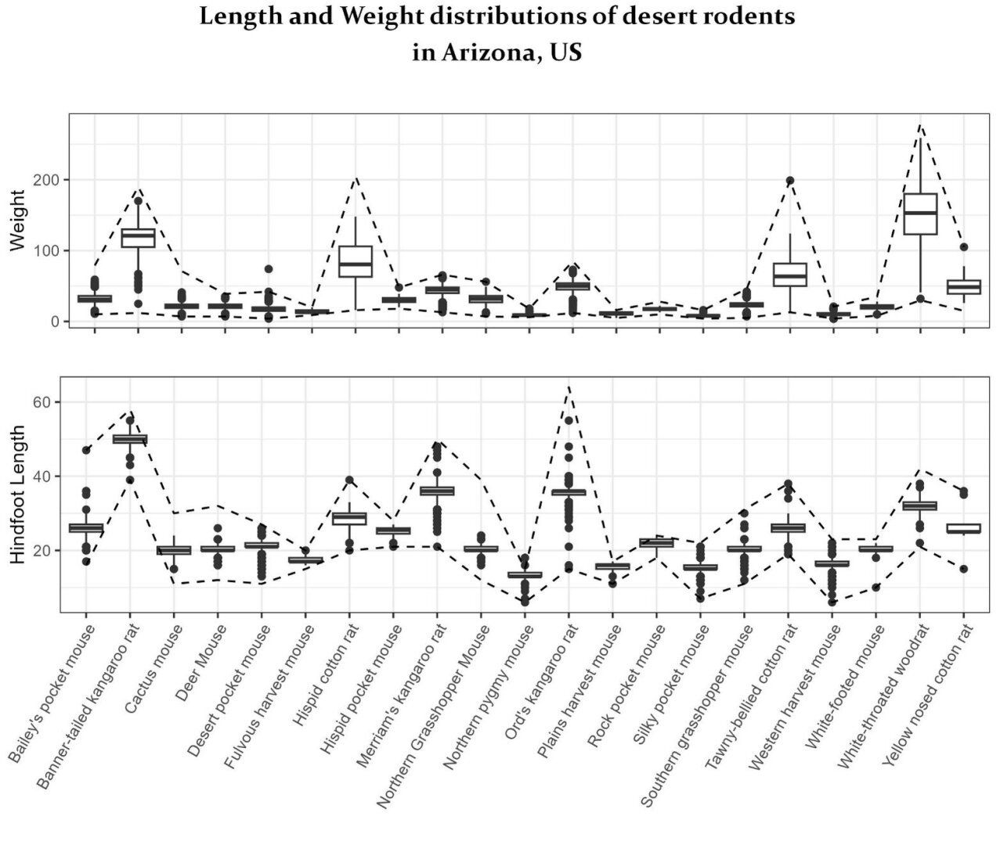

{.project-hero-img fig-alt="Visual of ranges of weight and length of different desert rodents Arizona"}

::: {.project-meta}
::: {.meta-item}
📅 March 2026
:::
::: {.meta-item}
🛠️ R, ggplot2, dplyr
<!-- ::: -->
<!-- ::: {.meta-item} -->
<!-- 📊 [Data source](https://example.com/data) -->
<!-- ::: -->
<!-- ::: {.meta-item} -->
<!-- 💻 [Code on GitHub](https://github.com/yourusername/repo) -->
:::
:::

## What & Why

This graph is a bit of a busy one but it's trying to give a vibe for lengths and 
weights of rodents, in general and per species. You can see overall and typical 
ranges and also have an idea for how chubby those mice are.

## Approach

Rodents are ordered left to right on alphabetical order while you can see boxplots 
and outliers for both length and weight in different facets, one on top of the other to allow for easy comparison.

