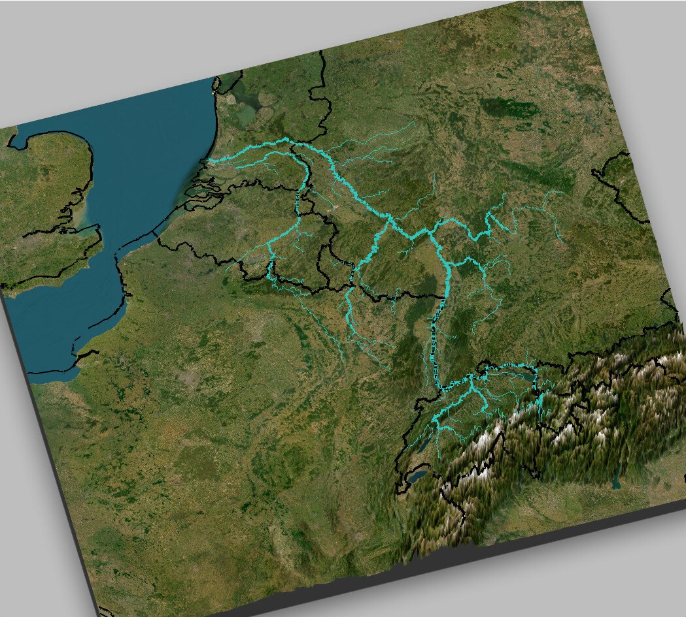

{.project-hero-img fig-alt="Relieve representation of the Benelux with the river Maas through it"}

::: {.project-meta}
::: {.meta-item}
📅 March 2026
:::
::: {.meta-item}
🛠️ R, rayshader, maps
:::
<!-- ::: {.meta-item} -->
<!-- 📊 [Data source](https://example.com/data) -->
<!-- ::: -->
<!-- ::: {.meta-item} -->
<!-- 💻 [Code on GitHub](https://github.com/yourusername/repo) -->
<!-- ::: -->
<!-- ::: -->

## What & Why

At the time I was dating someone living in Liege where the River Meuse goes through so I made this visual to see how, we looking at the river from our separate houses, we were looking at the same river. Afterwards I also added the Rhine river to see all the different places I've been to that are in the banks of these two rivers.

